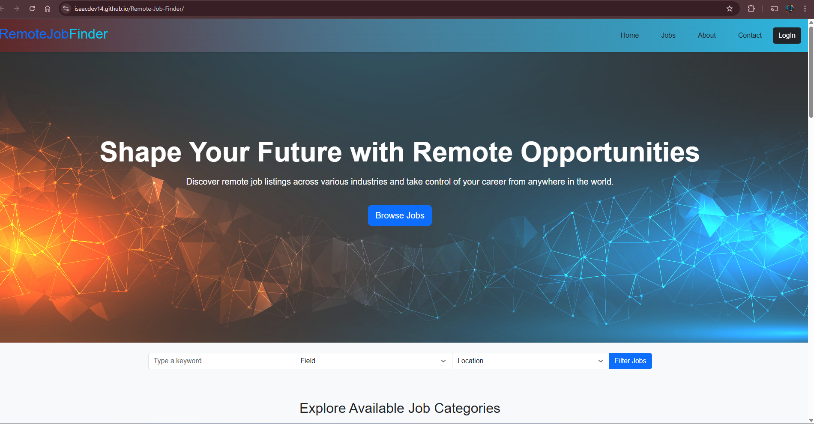

# Remote Job Finder

## Overview
Remote Job Finder is a web-based application that helps users find remote job opportunities based on their skills and preferences. This project is designed as a Single Page Application (SPA) using HTML, CSS, and JavaScript. It fetches job listings from a custom JSON file and displays them dynamically.

## Screenshots
### Homepage


### Job Details


## Features
- View a list of available remote jobs.
- Filter jobs based on category, company, or location.
- Search for specific job titles or keywords.
- Responsive design for desktop and mobile users.
- Bookmark jobs for later viewing.
- Interactive user interface with dynamic updates.

## Technologies Used
- **HTML5** - Structure of the web pages.
- **CSS3** - Styling and layout.
- **JavaScript (ES6+)** - Dynamic content and interactivity.
- **JSON** - Storing and fetching job listings.
- **Fetch API** - Fetching job data from a local JSON file.

## Installation & Setup
### Prerequisites
Ensure you have the following installed:
- A modern web browser (Chrome, Firefox, Edge, etc.)
- A text editor (VS Code, Sublime Text, etc.)
- A local web server (optional for better performance)

### Steps
1. **Clone the repository**:
   ```sh
   git clone https://github.com/your-username/remote-job-finder.git
   ```
2. **Navigate to the project folder**:
   ```sh
   cd remote-job-finder
   ```
3. **Open the project in a browser**:
   - You can simply open `index.html` in your browser.
   - Alternatively, use a local server:
     ```sh
     npx serve
     ```
     or
     ```sh
     python -m http.server
     ```

## Usage
- Enter job keywords in the search bar to find specific jobs.
- Use the filter options to narrow down results.
- Click on a job to view more details.
- Save/bookmark jobs for future reference.

## File Structure
```
remote-job-finder/
├── index.html          # Main HTML file
├── style.css           # Styling
├── script.js           # JavaScript logic
├── jobs.json           # Job data
├── README.md           # Project documentation
```

## API & Data Handling
Instead of using an external API, this project uses a static `jobs.json` file. The structure of this file is as follows:
```json
[
  {
    "id": 1,
    "title": "Frontend Developer",
    "company": "Tech Corp",
    "location": "Remote",
    "category": "Software Development",
    "description": "We are looking for a skilled frontend developer...",
    "apply_link": "https://example.com/apply"
  }
]
```

## Contributing
Contributions are welcome! To contribute:
1. Fork the repository.
2. Create a new branch: `git checkout -b feature-branch`
3. Make changes and commit: `git commit -m 'Added new feature'`
4. Push to the branch: `git push origin feature-branch`
5. Open a Pull Request.

## Troubleshooting
- **Jobs not loading?** Check if `jobs.json` is correctly linked in `script.js`.
- **CSS not applying?** Ensure the `style.css` file is properly referenced in `index.html`.
- **JavaScript errors?** Open DevTools (`F12`) and check the console for issues.

## Future Improvements
- Integrate a real-time job API.
- User authentication to save preferences.
- Advanced filtering and sorting.
- Dark mode option.

## License
This project is open-source and available under the [MIT License](LICENSE).

---

🚀 **Happy Coding!**
